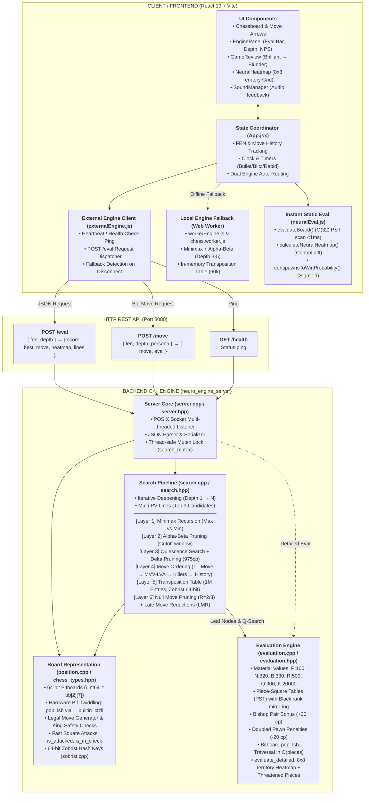

# ♞ Neuro-Chess

> **A high-performance modern chess engine and interactive web analysis platform with a dual-engine architecture.**

Neuro-Chess combines a blazingly fast **C++17 bitboard engine** with a modern **React 19** interface. It features a tournament-grade 6-layer Minimax search pipeline, real-time evaluation bar with win probability, interactive 8x8 territory heatmaps, automated game review with move classification, AI personas, and a seamless client-side Web Worker fallback.

---

## ⚡ Highlights

- **Dual-Engine Architecture**: High-throughput C++ Neuro-Core backend over HTTP REST with an instant client-side Web Worker fallback.
- **6-Layer Minimax Search**: Alpha-Beta pruning, Quiescence search, Move ordering (MVV-LVA, Killers, History), 1M-entry Transposition Table, Null Move Pruning, and Late Move Reductions.
- **Hardware-Accelerated Bitboards**: 64-bit integer representation with CPU intrinsics (`__builtin_ctzll` and bitwise popcount) traversing positions in $O(\text{pieces})$ time.
- **Evaluation & Threat Analysis**: Positional piece-square tables (PST), bishop-pair bonuses, doubled-pawn penalties, and an 8x8 spatial control heatmap.
- **Interactive React 19 Frontend**: Real-time evaluation bar, win probability percentage, Multi-PV line display, move classification (Brilliant $\rightarrow$ Blunder), AI personas, and audio feedback.

---

## 📐 System Architecture

An interactive vector diagram is available in the repository at **[`neuro_chess_architecture.excalidraw`](./neuro_chess_architecture.excalidraw)**. You can drag and drop it directly into [excalidraw.com](https://excalidraw.com) to view or edit.



---

## 🧠 The Search & Evaluation Engine

### 6-Layer Search Pipeline (`search.cpp`)

1. **Layer 1: Minimax Recursion**  
   Standard zero-sum game tree exploration alternating between White (Maximizer) and Black (Minimizer).
2. **Layer 2: Alpha-Beta Pruning**  
   Dynamically prunes search branches when a move proves worse than an already guaranteed line ($\alpha \ge \beta$).
3. **Layer 3: Quiescence Search & Delta Pruning**  
   Extends search on leaf nodes for captures and active tactical exchanges, preventing the **Horizon Effect**. Uses a $975\text{ cp}$ Delta Pruning safety threshold.
4. **Layer 4: Move Ordering**  
   Sorts candidate moves to maximize rapid $\beta$-cutoffs:
   - Transposition Table hash move
   - Most Valuable Victim – Least Valuable Attacker (MVV-LVA)
   - Killer Moves (`killer_moves[64][2]`)
   - History Heuristic table (`history_table[13][64]`)
5. **Layer 5: Transposition Table (TT)**  
   $2^{20}$ (1,048,576 entries) direct-mapped hash table indexed by 64-bit Zobrist keys storing exact, lower-bound, and upper-bound scores.
6. **Layer 6: Advanced Pruning Heuristics**  
   - **Null Move Pruning (NMP)**: Detects overwhelming positions by giving the opponent a free turn (`R = 2` or `3`).
   - **Late Move Reductions (LMR)**: Reduces search depth on late, non-tactical moves unless they prove unexpectedly strong.

### Static Evaluation (`evaluation.cpp`)

$$\text{Score} = (\text{Material}_W - \text{Material}_B) + (\text{PST}_W - \text{PST}_B) + \text{BishopPair} + \text{PawnPenalties}$$

- **Material Values**: Pawn (100), Knight (320), Bishop (330), Rook (500), Queen (900), King (20,000).
- **Piece-Square Tables (PST)**: Position-dependent value tables for every square, mirrored symmetrically for Black.
- **Bishop Pair Bonus**: $+30\text{ cp}$ reward for retaining both bishops.
- **Doubled Pawn Penalty**: $-20\text{ cp}$ per extra stacked pawn on the same file.
- **Spatial Heatmap & Threatened Pieces**: Computes square control ratios ($-1.0$ to $+1.0$) and locates hanging pieces for the React UI.

---

## 📁 Project Structure

```
Neuro-chess/
├── backend/                       # C++ High-Performance Engine
│   ├── src/
│   │   ├── chess_types.hpp        # Bitboard definitions, Piece/Color enums
│   │   ├── position.hpp/cpp       # Bitboard board state, movegen, attack rays
│   │   ├── zobrist.hpp/cpp        # 64-bit random keys for position hashing
│   │   ├── evaluation.hpp/cpp     # Material, PST tables, doubled pawns, heatmap
│   │   ├── search.hpp/cpp         # 6-layer Minimax, Alpha-Beta, TT, LMR, NMP
│   │   ├── server.hpp/cpp         # Multi-threaded HTTP server & JSON serializer
│   │   └── main.cpp               # CLI test harness and entry point
│   ├── Makefile                   # Build configuration (clang++ / g++)
│   ├── build.sh                   # Compilation script (-std=c++17 -O3)
│   └── start.sh                   # Auto-compile & launch engine daemon
├── src/                           # React 19 Frontend
│   ├── components/
│   │   ├── Chessboard/            # Interactive board, legal move dots, arrows
│   │   ├── EnginePanel/           # Eval bar, depth, NPS, best moves, PV lines
│   │   ├── GameReview/            # Move classification & accuracy breakdown
│   │   ├── Heatmap/               # 8x8 territory control visualization
│   │   ├── Modes/                 # Play vs Bot, Analysis, Engine vs Engine
│   │   ├── Header/                # Engine status indicators, persona switches
│   │   └── PersonaSelect/         # Bot personalities & playstyle selection
│   ├── engine/
│   │   ├── externalEngine.js      # REST API client connecting to C++ server
│   │   ├── workerEngine.js        # Controller for client-side Web Worker
│   │   ├── chess.worker.js        # Web Worker running Minimax fallback
│   │   ├── neuralEval.js          # Fast client-side static eval & heatmap
│   │   ├── chessAI.js             # Client heuristics & persona behaviors
│   │   └── soundManager.js        # Web Audio effects for moves & captures
│   ├── App.jsx                    # Core application state & mode orchestrator
│   └── index.css                  # Modern dark glassmorphism styling
├── neuro_chess_architecture.excalidraw # Excalidraw vector architecture diagram
├── package.json
└── vite.config.js
```

---

## 🚀 Getting Started

### Prerequisites

- **Node.js** (v18 or higher)
- **C++ Compiler** with C++17 support (`clang++` on macOS/Linux or `g++`)
- **Make** (standard on macOS and Linux)

### 1. Installation

Clone the repository and install frontend dependencies:

```bash
git clone https://github.com/raunaksinghhh/Neuro-chess.git
cd Neuro-chess
npm install
```

### 2. Start the Backend C++ Engine

Start the C++ engine server (runs on `http://localhost:8080`):

```bash
npm run server
```

> **Note**: `npm run server` automatically compiles `neuro_engine_server` using `-O3` optimizations if the binary is missing or outdated.

### 3. Start the Frontend

In a separate terminal, launch the Vite development server:

```bash
npm run dev
```

Open `http://localhost:5173` in your browser. The engine status in the top bar will show `CONNECTED (C++ Neuro-Core)` when the backend server is active.

---

## 📡 REST API Reference

The C++ engine exposes a lightweight HTTP server on port `8080`:

| Method | Endpoint | Description |
| :--- | :--- | :--- |
| `GET` | `/health` | Healthcheck returning engine name and connection status |
| `POST` | `/eval` | Analyzes position: accepts `{ fen, depth }`, returns `{ score, best_move, depth, nodes, nps, lines, heatmap }` |
| `POST` | `/move` | Computes best move: accepts `{ fen, depth, persona }`, returns `{ move, uci, time_ms, eval }` |

---

## 🎮 Game Modes

1. **Play vs AI**: Challenge custom AI personas (Positional Grandmaster, Tactical Blitz, Balanced Bot) with configurable time controls and takebacks.
2. **Analysis Board**: Paste any FEN, explore alternate lines, view Multi-PV evaluations, inspect territory heatmaps, and see tactical threat overlays.
3. **Engine vs Engine**: Watch the C++ engine or bots simulate matches against each other at customizable speeds.
4. **Game Review**: Review completed games with automated move classification (*Brilliant*, *Great*, *Best*, *Inaccuracy*, *Mistake*, *Blunder*).

---

## 📜 License

MIT License. Built for chess enthusiasts and engine developers.
